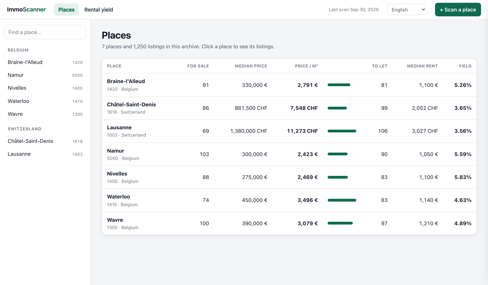

<div align="center">

# 🏠 ImmoScanner

**Scan real estate websites for any town, province or canton, get price statistics, and see what changed since your last scan.**

[](https://github.com/UyttenhoveSimon/ImmoScanner/actions/workflows/tests.yml)
[](https://github.com/UyttenhoveSimon/ImmoScanner/actions/workflows/canary.yml)


[](LICENSE)

[Quick start](#-quick-start) •
[Usage](#-usage) •
[Explorer](#-exploring-an-archive) •
[Architecture](#-architecture) •
[Design choices](#-design-choices) •
[Portals](#-supported-portals) •
[Tests](#-tests)

</div>

---

<p align="center">
  
</p>

## ✨ Features

- 🔎 **Search by city, postal code, region or URL** in Belgium 🇧🇪 and Switzerland 🇨🇭
- 📊 **Price statistics**: mean, median, median per m², quartiles
- 💰 **Gross rental yield**: compares sale prices with rents in the same area
- 🗂️ **History**: save each scan and see what is new, cheaper, more expensive or gone
- 🧹 **No double counting**: a flat listed on three websites counts once
- 🌐 **Web explorer**: compare places side by side in your browser
- 🤝 **Polite**: limits how many pages it reads and pauses between them

## 🚀 Quick start

```bash
uv sync
uv run python -m rustwright install chromium
uv run immoscanner Belgium --city Namur
```

> [!TIP]
> To use a specific Chromium build, set the `IMMOSCANNER_BROWSER_PATH` environment variable.

## 📖 Usage

Start with the **country**, then say where to look: a city, a postal code, a region, or a search URL copied from a portal.

```bash
uv run immoscanner Belgium --city Namur
uv run immoscanner Belgium --region "Brabant wallon" --max-pages 60
uv run immoscanner Belgium --postal-code 1000 --type apartment --rent
uv run immoscanner Switzerland --postal-code 1618 --output ch.json
uv run immoscanner Belgium --postal-code 1000 --type apartment --yield
uv run immoscanner Belgium --city Namur --store namur.db
uv run immoscanner Belgium --url "https://www.immoweb.be/fr/recherche/maison/a-vendre/namur/5000?countries=BE"
```

### Options

| Flag | What it does |
| --- | --- |
| **Where to look** | |
| `--city NAME` / `--postal-code CODE` | Give either one; the other is looked up for you |
| `--region NAME` | Search a whole province or canton instead of one town |
| `--url URL` | Scan a search page copied from a portal, following its pages |
| **What to look for** | |
| `--type any\|house\|apartment` | Type of property |
| `--rent` | Look at rentals instead of properties for sale |
| `--yield` | Look at both, and work out the gross rental yield |
| `--source NAMES` | Only keep listings that came from these websites (comma separated) |
| `--exclude-source NAMES` | Leave out listings that came from these websites (comma separated) |
| `--max-pages N` | How many result pages to read per portal (default `20`) |
| **Output** | |
| `--store FILE.db` | Save the scan, and show what changed since the previous one |
| `--output FILE.json` | Save the listings to a JSON file |
| `--serve --store FILE.db` | Open the saved scans in your browser instead of scanning |
| `--port N` | Port for the browser view (default `8765`) |
| `--debug` | Log every listing as it is read |

### What a scan shows

```console
$ uv run immoscanner Belgium --postal-code 5000 --type house --store namur.db
INFO ImmoScanner.ImmoScanner: searching Namur (5000) in Belgium
INFO ImmoScanner.Workers.RealEstateWorker: immovlan.be: 30 listings
INFO ImmoScanner.Workers.RealEstateWorker: immoweb.be: 129 listings
159 listings, 117 unique
listings: 111
projects: 6
mean_price: 443,521
median_price: 395,000
median_price_per_m2: 1,923
since the last run: 117 new, 0 repriced, 0 gone, 0 unchanged
  new      950 000 Namur https://immovlan.be/fr/detail/maison/a-vendre/5000/namur/vbe67521
  ...
```

How to read it:

- **`159 listings, 117 unique`**: the portals returned 159 listings, and 117 were left once duplicates were removed.
- **`listings` / `projects`**: those 117 are split into ordinary properties (111) and new-build developments (6). Only ordinary properties count towards the statistics.

**Scan again later** with the same `--store` file, and you only see what changed:

```console
since the last run: 0 new, 2 repriced, 1 gone, 114 unchanged
  down    395,000 -> 379,000 € https://www.immoweb.be/fr/annonce/...
  gone    289000.0 Namur https://immovlan.be/fr/detail/...
```

**With `--yield`**, the area is scanned twice, once for sale and once for rent:

```console
$ uv run immoscanner Switzerland --postal-code 1003 --type apartment --yield
median_price_per_m2: 11,033
rental_median_price: 2,500
rental_median_price_per_m2: 33.36
gross_yield_percent: 2.04
```

### Filtering by original website

Some portals, like comparis, collect listings from other websites. Each listing then says where it originally came from, in its `source` field. `--source` and `--exclude-source` filter on that field. The match ignores case and accepts part of a name, so `homegate` matches `homegate.ch`. A portal that publishes its own listings counts as their source.

Filtering happens **before** duplicates are removed. So if a flat appears on several websites and you ask for one of them, you get that website's copy.

```console
$ uv run immoscanner Switzerland --postal-code 1003 --type apartment --rent --source homegate
102 listings, 13 from the asked sources, 11 unique
```

### JSON output

`--output` writes one JSON object per listing, with duplicates already removed.

<details>
<summary>Example listing</summary>

```json
{
  "url": "https://www.immoweb.be/fr/annonce/maison/a-vendre/namur/5000/21841479",
  "id": "21841479",
  "platform": "immoweb.be",
  "source": "",
  "description": "MAISON DE CARACTÈRE DE 224 M² À RÉINVENTER À BEEZ",
  "type": "House",
  "price": 369000,
  "price_text": "369 000 €",
  "currency": "EUR",
  "postal_code": "5000",
  "city": "Namur",
  "livable_square_meters": 294,
  "bedrooms_number": 5,
  "rooms_number": 0,
  "latitude": 50.4666968,
  "longitude": 4.915161299999999,
  "posted_date": "2026-09-16T13:04:43.191Z",
  "is_project": false,
  "price_min": 0,
  "price_max": 0
}
```

</details>

> [!NOTE]
> For a new-build development, `price` is `0` and the price range is in `price_min` and `price_max`.
> `latitude` and `longitude` are only filled in when the portal publishes a location.

## 🗺️ Exploring an archive

Scan a few places into the same file, then open it in your browser:

```bash
uv run immoscanner Belgium --postal-code 1410 --store be.db
uv run immoscanner Belgium --postal-code 1420 --store be.db
uv run immoscanner Belgium --postal-code 1400 --store be.db
uv run immoscanner Belgium --serve --store be.db
```

Then go to **http://127.0.0.1:8765**. From there you can:

- 📈 **Compare places**: number of listings, median price, median price per m², quartiles.
- 📋 **Open one place** to see its listings, filter them by website, and see which prices changed since the first scan.
- ↕️ **Sort any table** by clicking a column heading. Click again to reverse the order.
- 🏷️ **See real town names**: scans are saved by postal code, but the page shows the town name (e.g. "Nivelles"). The search form accepts either.
- 💰 **Compare rental yields**: scan a place both for sale and for rent, and its yield appears next to the other places'.
- ➕ **Add a place** with the form at the top. The scan runs in the background and the page updates when it is done. Only one scan runs at a time: if one is already running, a new request is turned down, not queued.

> [!IMPORTANT]
> **Is it safe?** Yes:
> - **Only you can open it.** The page works on your own computer, not from other devices on your network.
> - **Browsing doesn't change your data.** Only a scan you start from the form adds to your file.
> - **The form can't do anything unexpected.** It offers the same choices as the command line, and nothing else.

## 🐍 As a library

```python
from ImmoScanner.ImmoScanner import ImmoScanner
from ImmoScanner.Means.RealEstateResearch import APARTMENT, RENT

scanner = ImmoScanner()
results = scanner.research_real_estate("Belgium", postal_code="1000",
                                       type=APARTMENT, rent_or_buy=RENT)
listings = scanner.duplicate_finder(results)
insights = scanner.get_insights(listings)
```

## 🤝 Being polite to the websites

By default a scan reads at most **20 pages per portal** and waits **800 ms** between pages. These limits are `MAX_PAGES` and `PAGE_DELAY_MS` on `RealEstateWorker`. Different portals are scanned at the same time, but the pages of one portal are read one after another.

## 🏗️ Architecture

```
Console.py          the command line; prints statistics and what changed
ImmoScanner.py      runs a scan: finds the place, asks each portal, removes duplicates
Countries/          which portals cover each country, and postal code lookups
Workers/            one class per portal, sharing a common base
Means/              what is searched for (Research) and what comes back (Result)
Intellectuals/      statistics
Archives/           the SQLite archive of every listing ever seen
Showrooms/          the browser view of an archive, and the scans it starts
```

**What happens during a scan:**

1. `CountryFactory` creates the country, which knows which portals to use.
2. If you gave only a city or only a postal code, the other is looked up on geonames.
3. Each portal gets its own `RealEstateResearch` and runs in its own thread.
4. `RealEstateWorker.get_findings` reads the result pages and turns each listing into a `RealEstateResearchResult`.
5. The listings from all portals are combined, and duplicates are removed.
6. Statistics are computed, compared with the archive, and printed.

### Adding a portal

`RealEstateWorker.get_findings` already handles reading the pages. A new portal only fills in what is specific to it:

| Hook | What it is for |
| --- | --- |
| `url_builder(research, page)` | The search URL for a given page |
| `CARD_SELECTOR` | How to find the listings on a page |
| `extract_findings(card)` | How to turn one listing into a result |
| `total_results(soup)` | How many listings the portal says it has, if it says |
| `PROBE_SELECTOR` | Something that proves a simple download returned the real listings |
| `WAIT_FOR` | What to wait for before reading the page, when a browser is used |
| `fetch_page(research, page)` | Only override this if the listings are not in the page's HTML |

Then add the class to its country under `Countries/`, and save a search page into `tests/fixtures/` so it can be tested without going online.

## 🧠 Design choices

Click a topic to expand it.

<details>
<summary><b>Why rustwright instead of Playwright</b></summary>

[rustwright](https://github.com/Skyvern-AI/rustwright) is a Rust rewrite of Playwright with the same Python API, so switching took one import change. It controls Chromium directly, without the separate Node.js process Playwright needs, and it uses the Chromium you already have instead of downloading its own.

</details>

<details>
<summary><b>Cheapest download method first</b></summary>

Each page is downloaded in the cheapest way that works:

1. a plain HTTP request with `requests`;
2. the same request through [curl_cffi](https://github.com/lexiforest/curl_cffi), which looks like a real browser at the network level;
3. a real browser.

immoweb and immovlan work with a plain request, which takes well under a second per page, against several seconds with a browser. comparis rejects plain requests based on how the connection is made, whatever the headers say. So it uses curl_cffi, which brought a scan down from 15 s to 6 s.

If a method fails, it is not tried again for the rest of the scan, so a portal that needs a browser only wastes one attempt per method. Once a method has worked, it is kept: portals return a 404 error for a page past the last one, and that must not be mistaken for the method failing.

</details>

<details>
<summary><b>Reading the portal's own data, not the page layout</b></summary>

Both the Belgian and the Swiss portals include their listings as JSON inside the page. That JSON has more detail than what is displayed: surface, number of bedrooms, location. immoweb attaches it to each listing on the page, and comparis to a `__NEXT_DATA__` block.

Page layouts change with every redesign, but this data changes much less often. On immoweb the data disappears once the page has fully loaded in a browser, so when a browser is used, the scanner falls back to reading the page layout.

</details>

<details>
<summary><b>Knowing when to stop reading pages</b></summary>

immoweb only shows the number of pages and results after the page has loaded in a browser, so a plain download can't see them. The scanner simply keeps going until it reaches an empty page, or until it has as many listings as the portal says it has.

It counts each listing only once, because immoweb repeats the same sponsored listing on every page. Reaching a page past the last one ends the scan normally and keeps everything collected so far.

</details>

<details>
<summary><b>Writing town names the way each portal expects</b></summary>

The two Belgian portals want opposite things, and getting it wrong silently loses listings.

- **immoweb** uses only the postal code and ignores the town name. But an apostrophe in the name breaks the search: "Braine-L'Alleud" returned **no listings at all**, while the postal code alone returns 288. So immoweb is searched with `1420` only.
- **immovlan** needs both. With only a postal code, it picks the first town under that code: `1400` gives Monstreux with 2 listings, not Nivelles with about a hundred. So it gets `1400-nivelles`. If immovlan doesn't recognise the name, it searches the whole country instead. The scanner now warns about that, instead of reporting a town with 32 000 properties.

</details>

<details>
<summary><b>Each portal searches regions its own way</b></summary>

Each of the three portals can search a whole province or canton directly, instead of going through every postal code in it. They just write it differently:

| Portal | How a region is written |
| --- | --- |
| immoweb | in the URL path: `/brabant-wallon/province` |
| immovlan | as a URL parameter: `?provinces=brabant-wallon` |
| comparis | in the location field: `Canton Vaud` (just `Vaud` would mean the *town*) |

Regions are listed in French, and each portal translates them as needed. That's where the exceptions are handled: for example, comparis understands "Schwyz" but not "Schwytz". All 11 Belgian provinces and all 26 Swiss cantons were tested on the real websites.

</details>

<details>
<summary><b>A page limit, with a clear warning</b></summary>

A scan reads at most `--max-pages` pages per portal, 20 by default. That's about 600 listings on immoweb and 400 on immovlan. A town never reaches that limit, but a province always does: Brabant wallon alone has 3 000 listings.

When the limit is reached, you only get the first pages in the order the portal chose, which is not a fair sample of the market. The scanner tells you so clearly, so you don't mistake the statistics for the full picture.

</details>

<details>
<summary><b>One vocabulary for all portals</b></summary>

You always search with `buy`/`rent` and `any`/`house`/`apartment`, and each portal translates that into its own terms (`a-vendre`, `acheter`, `DealType: 20`). You never need to know that immoweb calls "all types" `maison-et-appartement`.

</details>

<details>
<summary><b>Two ways to compute the yield</b></summary>

The usual way divides the median rent by the median price. The catch: rentals tend to be small and properties for sale tend to be large, so this ends up comparing the rent of a studio with the price of a family house.

The other way divides the median **per square metre** values, which removes the size difference.

Both are shown, because they don't always agree. On four towns in Walloon Brabant, they pick a different winner: per square metre, Nivelles leads with 5.79%; on plain medians, Wavre leads with 4.13%. The explorer shows both side by side, highlights the best place for each, and shows the medians they come from.

</details>

<details>
<summary><b>How duplicates are found</b></summary>

The same flat is often listed on several websites, with a different ID on each. Two listings are treated as the same property when they match on either:

- **postal code, price, surface and bedrooms**, which every portal provides; **or**
- **location and price**, with the location rounded to about 11 metres, for portals that publish a location.

Matching on either one is enough, so two listings whose surface differs by one square metre are still recognised as one.

immoweb and comparis publish locations; immovlan doesn't. immoweb also hides it on sponsored listings and when the seller hides the address, so about half of a Belgian scan has no location. Those listings rely on the first rule, which is why it only uses information every portal provides.

The location rule helps most on comparis, where the same property often arrives from several websites. Its one weakness: two identical flats in the same building, at the same price and size, look like one listing posted twice, and are merged. Real duplicates are far more common, so this is a deliberate trade-off, and a test documents it.

</details>

<details>
<summary><b>New-build developments are kept apart</b></summary>

A new-build project is advertised as a price range for a whole building. Mixing that into a median wouldn't mean anything. So these listings are marked with `is_project`, carry `price_min` and `price_max`, are left out of the statistics, and are still shown in the results.

</details>

<details>
<summary><b>Keeping a history, not just a snapshot</b></summary>

A single scan can't tell you what is new, what got cheaper, or what sold. With `--store`, every listing and every price it has ever had is saved in a SQLite file, and each scan shows what changed since the last one.

</details>

<details>
<summary><b>An explorer with no extra dependencies</b></summary>

The archive is a SQLite file and the explorer is only meant for you, on your own computer. So it is built with Python's built-in web server, a single HTML page and hand-drawn SVG charts, with no web framework or charting library.

Medians are calculated in Python, because SQLite has no median function and an archive has thousands of rows, not millions.

To dig deeper into the data, use pandas or DuckDB. Both can read the archive file directly, without being added to the scanner.

</details>

<details>
<summary><b>Using lxml to read HTML</b></summary>

Several websites, including geonames, have HTML that Python's built-in parser can't handle: it once squeezed a whole table into its first row. That's why postal code lookups used to return a neighbouring village.

</details>

<details>
<summary><b>Anti-bot pages are reported, not bypassed</b></summary>

If a portal shows a captcha, the scanner raises a `BotWallError` instead of returning zero listings. That way, a blocked portal is never mistaken for a market with nothing for sale.

</details>

## 🌍 Supported portals

| Portal | Country | Where the data is read | Downloaded with | Location |
| --- | :---: | --- | --- | :---: |
| immoweb.be | 🇧🇪 | JSON inside each listing | plain HTTP | partly |
| immovlan.be | 🇧🇪 | schema.org tags on each listing | plain HTTP | ❌ |
| comparis.ch | 🇨🇭 | the `__NEXT_DATA__` block | curl_cffi | ✅ |

- immovlan moved away from `immo.vlan.be`, which now returns a 503 error.
- **homegate.ch** and **immoscout24.ch** block automated access everywhere, including their APIs, so they aren't scanned directly. Their listings still show up through comparis, which collects both, and each listing names its original website in `source`.

## 🧪 Tests

```bash
uv run pytest                     # offline, using saved copies of portal pages
uv run pytest --cov               # with coverage: 99% today, CI requires at least 95%
uv run pytest -m live             # against the real websites
```

When a portal redesigns its website, nothing crashes: scans just quietly return fewer listings and the numbers drift. Two kinds of tests guard against that:

- **Offline tests** run on saved copies of each portal's pages, in `tests/fixtures/`. They check the exact page elements and data fields the scanner relies on, so a change shows up as a failing test. When a portal changes for good, save a fresh copy of its page.
- **Live tests** run against the real websites, every Monday in CI, as an early warning.

Apart from the live tests, nothing goes online: geonames, the portals, the HTTP clients and the browser are all replaced by saved pages or fakes.

<details>
<summary>Test files and what they cover</summary>

| File | Covers |
| --- | --- |
| `test_workers.py` | Reading listings from saved search pages |
| `test_fallbacks.py` | What each portal does when data is missing, and the shared defaults |
| `test_fetching.py` | The download methods and page reading, fully simulated |
| `test_worker.py` | HTTP and browser sessions, and closing them |
| `test_geolocation.py` | Reading locations, and which listings they merge |
| `test_countries.py` | Postal code lookups, and which portals each country uses |
| `test_pipeline.py` | A full scan: all portals, failures, search URLs |
| `test_scanner.py` | Duplicates, statistics, filtering by website |
| `test_store.py` | The archive and what changed between scans |
| `test_console.py` | The command line: options, printing, saving |
| `test_regions.py` | Provinces and cantons, and how each portal writes them |
| `test_showroom.py` | The explorer's pages and its web server |
| `test_runner.py` | Scans started from the explorer |
| `test_live_portals.py` | The live tests (`-m live`) |

</details>

## 📄 License

[Apache 2.0](LICENSE). If you redistribute ImmoScanner, keep the [NOTICE](NOTICE) file with it.
